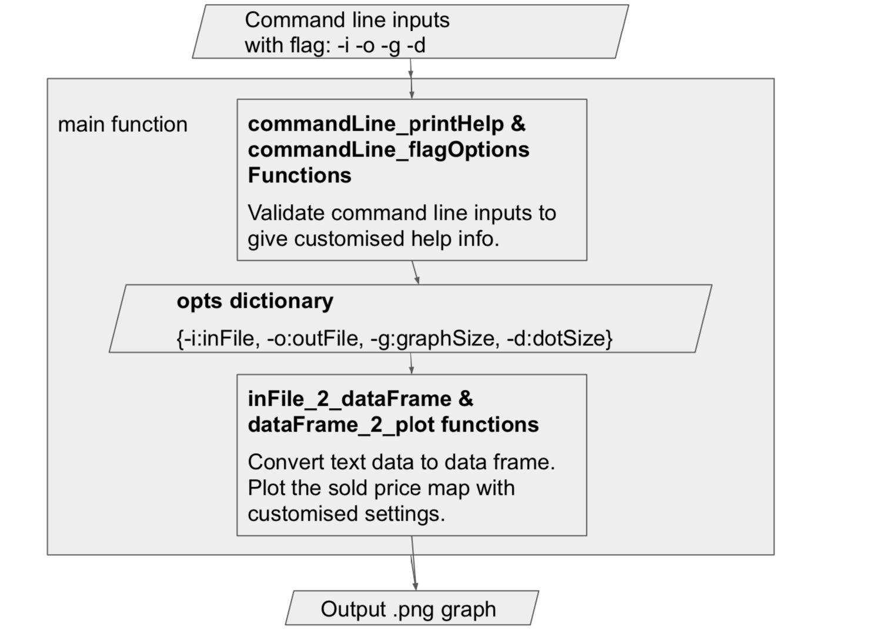

```
* Updates 08/10/19:
    1. Updated the file name to plotSoldPriceMap_v2.py
    2. Using getopt command line flag I/O rather than args.
        Reason: more informative, graph size and dot size become optional inputs. 
    3. Updated varible/function names (I really appreciate for the feedback!)
        -- Updated variable names to readable camel style. 
        -- Updated function names to readable snake style (sometimes combined with camel style within the name).   
        -- Some unchanged names based on conventions, I will adapt to the company tech team style when I can read scripts from you. :)
    4. Added code structure for main functionalities explaination.
```
#### A. Input flags
   * -h : Print this help message and exit.
   * -i FILE : input-text-data-file-name.txt, process text from input file FILE.
   * -o FILE : output-graph-file-name.png, write results to output file FILE.
   * -g PARAMETER: The size of the output graph, 
                    I suggest choosing a number between 5 and 30.
   * -d PARAMETER: The size of each scatter point in the graph, 
                    I suggest choosing a number similar to the graph size,
                    so that a larger graph has bigger dots.
                    
                    
#### B. Example inputs: copy this command to the terminal: 
   *   Using the default graph size and dot size:           
        ```
            python plotSoldPriceMap_v2.py -i sold-price-data.txt -o priceMap.png    
        ```
    
   *   Using a customesed graph size and dot size:      
        ```
            python plotSoldPriceMap_v2.py -i sold-price-data.txt -o priceMap.png -g 6 -d 8  
        ```
   *   Hint: enter to run the code, you can then find a file called priceMap.png            
        which contains the graph that the program just ploted. 
        
#### C. What does this file do?
   *  Reads the text file to the dataframe (X, Y, P).
   *  Plots each point onto a grid. 
        The points given colours representing how expensive 
        a house was in relation to other houses. 
   *  The boundries of the color range are: 
        ```
            0% - 5%     yellow
            5% - 25%    pink
            25% - 75%   red
            75% - 95%   green
            95% - 100%  cyan
        ```
    
#### D. Code structure for main functionalities:



    
       Detailed instructions:
       1. main function 
            I/O: Inputs: From the command line with flag -i -o -g -d (link to dataFrame_2_plot function inputs);
                 Output: A .png file as the sold price map (link from dataFrame_2_plot function output)
            Steps:
            (1) Setup help and simple validations for command line flag inputs.
            (2) Link the sys input to function's input.
            (3) Run the dataFrame_2_plot function to generate the sold price map graph.

       2. dataFrame_2_plot function
            I/O: Inputs: inFile: Name of the input .txt file (linked from the command line).
                         outFile: Name of the output .png graph (linked from the command line).                       
                         graphSize: A str data type integer for customised graph size (optional input linked from the command line or the commandLine_flagOptions function).  
                         dotSize: A str data type integer for customised dot size (optional input linked from the command line or the commandLine_flagOptions function).
                 Output: A .png file as the sold price map.
            Steps:
                (1) Saves X, Y & P values from .txt file to a dataframe (using inFile_2_dataFrame function).
                (2) Plots the sold price map graph with a colour bar (see more details within the function).
                (3) Save the plot to a .png file.

    
#### E. Futher improvements:
   *  Unit tests - coming later.
   *  System tests - coming later.
   *  Using both short and long input options 
        ``` 
            e.g. 'h:i:o:g:d:' with ['help','inFile','outFile','graphSize','dotSize'].
        ```
   *  I can add code structure for the command line flag settings if required.

#### F. The libraries used are: 
matplotlib, pandas, numpy, sys, & getopt.
