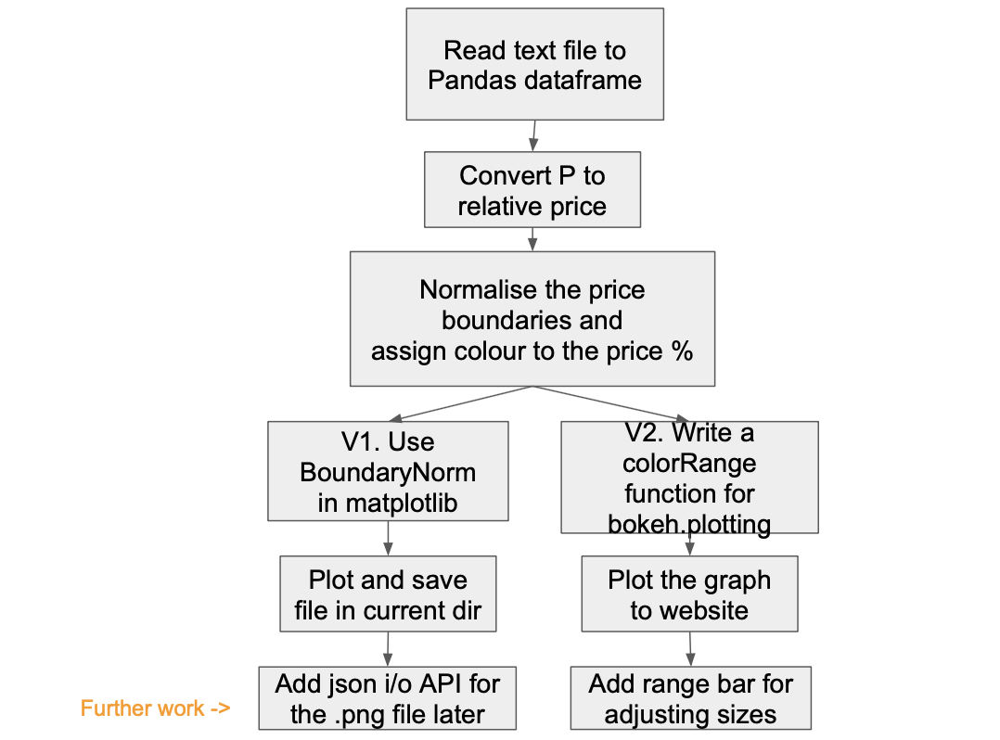

## update 10/10/19
#### full-stack:
   1. color bar problem solved! yeah :dancer:
   2. add install requirment.txt
   3. next to do   
        - check varible/function names
        - write/draw code structure
        - tests
        - make the front-end nicer, maybe add range bar
        
#### back-end:
   1. Updated the file name to plotSoldPriceMap_v2.py
   2. Using getopt command line flag I/O rather than args.
        Reason: more informative, graph size and dot size become optional inputs. 
   3. Updated varible/function names (I really appreciate for the feedback!)
        - Updated variable names to readable camel style. 
        - Updated function names to readable snake style (sometimes combined with camel style within the name).   
        - Some unchanged names based on conventions, I will adapt to the company tech team style when I can read scripts from you. :)
   4. Added code structure for main functionalities explaination.
   5. next to do - tests

# SoldPriceMap
#### A. Problem description and proposed solution
The problem I tried to solve here is to load the text file data and plot the data into a heatmap style scatter-graph on a website. Please see this flow diagram for the steps I took to solve the problem and the detailed descriptions that follow below (updated version10/10):




```
The steps I took are:
    1. Reading the text file to a dataframe (using pandas.read_csv).
    2. Coverting the price value (P) to relative/percentage price, meaning (P1, P2,...Pn)/(Max_P-Min_P).  
    3. Setting the colour proportions and % boundaries for the plot, for which I used two methods:
      3.1 Using matplotlib.colors.BoundaryNorm to normalise the ListedColormap with suggested boundaries.
      3.2 Using bokeh.plotting for the realtime web plot display. 
         3.2.1 It was not as simple as BoundaryNorm, and I have written a function (colorRange) to locate each colour with different price boundaries.
      3.3 For both approaches, the boundaries of the colour range are: 
        0% - 5%     yellow
        5% - 25%    pink
        25% - 75%   red
        75% - 95%   green
        95% - 100%  cyan
    4. Plotted each point onto a grid. 
        The points are filled with colours representing how expensive a house was in relation to other houses. 
        You are able to choose: 
          - The size of the plot graph.
          - The size of the points.
          - The different input.txt file names. 
          - The output.png file names.
    5. Compromises and assumptions:
      5.1 I ran out of time while working on the plot in the bokeh/web version. Also it would be great to know how to display the colour bar in the proportional style shown in the matplotlib plot.
      5.2 I personally did not have much experience in unit testing, so I would like to add some more to it later.
      5.3 Although diffierent input files can be processed, the data structure has to be X, Y, Z (X and Y for coordinates, Z for price). Otherwise the remaining column would be ignored. Also if there are only two columns of data in the text file, there will be an error. I would like to solve this later.
      5.5 More exceptions and validation needs to be added to validate the inputs.
 ```
#### B. For the Backend/junior role

- Go to the [Backend](Backend) folder:
  Download the [plotSoldPriceMap_v2](Backend/plotSoldPriceMap_v2.py) file;
  Save it in the same folder as sold-price-data.txt 
  
- Example command in terminal: 
  ```
  python plotSoldPriceMap_v2.py -i sold-price-data.txt -o priceMap.png -g 6 -d 8
  ```
  
  This command wil generate a png file called spm.png with a graph size of 6 and a scatter dot size of 8.
  
  

- Detailed explaination for the inputs:

   * -h : Print this help message and exit.
   * -i FILE : input-text-data-file-name.txt, process text from input file FILE.
   * -o FILE : output-graph-file-name.png, write results to output file FILE.
   * -g PARAMETER: The size of the output graph, 
                    I suggest choosing a number between 5 and 30.
   * -d PARAMETER: The size of each scatter point in the graph, 
                    I suggest choosing a number similar to the graph size,
                    so that a larger graph has bigger dots.
- code structure, please see more details at [Backend-README](/Backend/README.md) file

#### C. Simple website demo
Please clone this repo for easier running of the code.
- Go to [FullStack](FullStack) folder.
  * If you have copied/cloned all folders and files from FullStack dir:
  
    - Installations:
    
       Required libraries are listed in requirements.txt file. 
       
       Run the installation for Django and Bokeh with:
       ```
       pip install -r requirements.txt
       ```
    - Run python code: 
    
       Run the command: 
       ```
       python manage.py runserver
       ```

       Open the local server http://127.0.0.1:8000/
  
         update 10/10


#### D. Other works in my [repositories](https://github.com/ChenhaoWu18)
 - The [books](https://github.com/ChenhaoWu18/BTFurther_modules) I wrote for [BT Further apprentice software engineer training](https://www.codefirstgirls.org.uk/bt--cfg-digital-intensive.html).
 - I have experimented with Kivy to write [phone apps](https://github.com/ChenhaoWu18/KivyProject_sandbox).
 - Django website for [to do list](https://github.com/ChenhaoWu18/DjangoProject_sandbox).
 - Django website for [internal website](https://github.com/ChenhaoWu18/CourseWeb_sandbox) of a programme I [taught](https://oxmedica.com/about/).  
 
#### E. Contact information
Please feel free to give suggestions through my email: chenhao.wu18@gmail.com 
or through my [LinkedIn](https://www.linkedin.com/in/chenhao-wu-31985720/)
